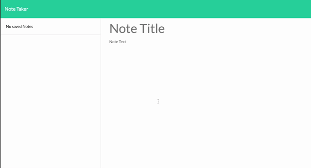

# 11-Note-Taker
[GitHub Repo](https://github.com/mrcaseyrobison/11-Note-Taker)  
[Heroku Live URL](https://mrcaseyrobison-note-taker.herokuapp.com/)

# Description

# Table of Contents
* [Installation](#installation)  
* [Usage](#usage)  
* [License](#license) 

# Installation
Installation of the following dependency is required to run the application locally:  
[Express](https://www.npmjs.com/package/express)

# Usage
Go to the link to access the app on Heroku. Click the "get started" button to navigate to the app itself. Within the app the user can create a note that can be saved to the database. The user can then edit or delete whichever note they choose.
